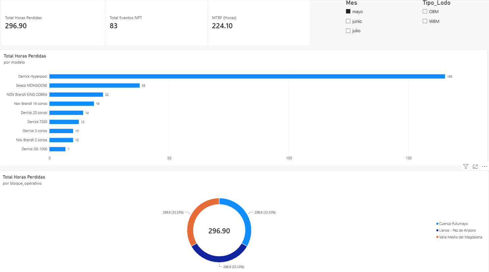
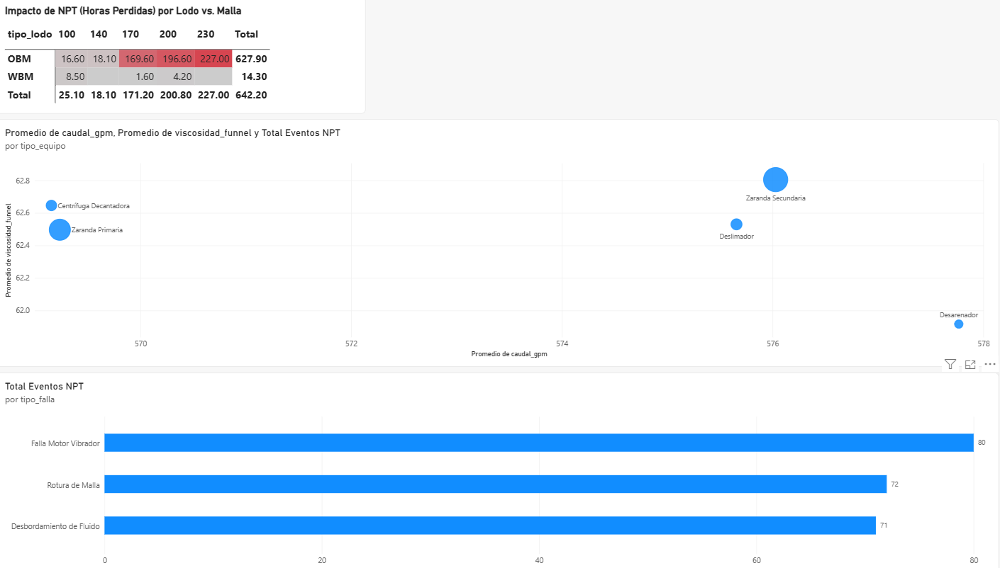
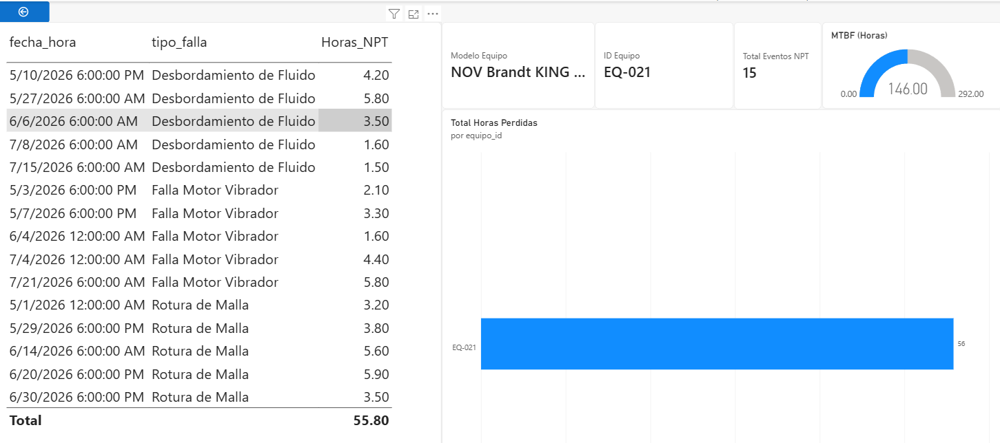

# 🛢️ Optimización de Eficiencia Operativa y Tiempos No Productivos (NPT) en Control de Sólidos

[](https://colab.research.google.com/drive/17CobVY5iI1bQ5R_fGBtWJKym84ip9-mD#scrollTo=ac0acffb-9b76-435b-85a8-a8d13da30eeb)


Un proyecto analítico End-to-End diseñado para diagnosticar, cuantificar y mitigar los Tiempos No Productivos (NPT) asociados a los equipos de control de sólidos en operaciones de perforación petrolera.

## 📖 El Caso de Negocio (Marco SCQA)

*   **Situación (Situation):** En las operaciones de perforación (Bloques Valle Medio del Magdalena, Llanos, Putumayo), el sistema de control de sólidos es crítico para mantener las propiedades del fluido.
*   **Complicación (Complication):** Se ha detectado un incremento anormal en los tiempos de falla (NPT) de equipos clave (Zarandas, Centrífugas, Desarenadores), superando las 800 horas de tiempo perdido acumulado, lo que impacta directamente el presupuesto y la logística del pozo.
*   **Pregunta (Question):** ¿Qué equipos están causando el mayor impacto económico y cuáles son las condiciones físicas y operativas exactas que detonan estas fallas mecánicas?
*   **Respuesta (Answer):** Mediante modelado de datos y análisis de causa raíz, se descubrió que el problema no radica en la calidad mecánica de los equipos, sino en un escenario operativo específico: la saturación rápida al combinar **Lodo Base Aceite (OBM)** de **alta viscosidad** con **mallas finas (API >= 170)**.

## 🛠️ Arquitectura del Proyecto

Este proyecto fue desarrollado en tres fases integrales, abarcando desde la ingeniería de datos hasta la inteligencia de negocios:

### Fase 1: Simulación de Datos (Python)
Dado que los datos reales de NPT son confidenciales, se desarrolló un script en Python (Pandas, NumPy) que genera bases de datos sintéticas pero estadísticamente lógicas.
*   Creación de +9,000 registros operativos.
*   Generación de dimensiones de equipos (Derrick Hyperpool, NOV Brandt, etc.) y pozos.
*   Implementación de reglas probabilísticas basadas en física real de fluidos.

### Fase 2: Modelado Relacional y Análisis Exploratorio (SQLite / SQL)
Los archivos CSV generados se ingirieron en un motor SQLite en memoria.
*   Estructuración de un modelo de datos relacional (Esquema Estrella).
*   Desarrollo de consultas SQL para calcular el Impacto Operativo, Análisis Geográfico y Tiempos Medios Entre Fallas (MTBF).

### Fase 3: Dashboard Ejecutivo y Diagnóstico Técnico (Power BI)
Desarrollo de una aplicación analítica interactiva de 3 niveles:
1.  **Visión Ejecutiva NPT:** KPIs de alto nivel, impacto por modelo de máquina y distribución geográfica del NPT.
2.  **Análisis de Causa Raíz:** Matrices de calor e indicadores de dispersión cruzando viscosidad, tipo de fluido y tamaño de malla para evidenciar el cuello de botella operativo.
3.  **Rendimiento de Flota (Drill-through):** Análisis detallado del rendimiento y MTBF individual por máquina para la programación de mantenimiento predictivo.

## 📊 Vistazo al Dashboard

*(Nota: Reemplaza estas líneas con las rutas reales de tus capturas de pantalla)*




## 🚀 Cómo reproducir este proyecto

Puedes interactuar con el código y visualizar el modelo de las siguientes maneras:

1.  **Código en la Nube (Recomendado):** Ejecuta y audita la simulación en Python y las consultas SQL directamente en Google Colab sin instalar nada:
    👉 [Abrir Notebook en Google Colab](https://colab.research.google.com/drive/17CobVY5iI1bQ5R_fGBtWJKym84ip9-mD#scrollTo=ac0acffb-9b76-435b-85a8-a8d13da30eeb)
2.  **Clonar el repositorio localmente:** 
    ```bash
    git clone [https://github.com/wasuarezm-cell/Optimizacion-de-Eficiencia-Operativa-y-Tiempos-No-Productivos-NPT-en-Control-de-Solidos-Simulated.git](https://github.com/wasuarezm-cell/Optimizacion-de-Eficiencia-Operativa-y-Tiempos-No-Productivos-NPT-en-Control-de-Solidos-Simulated.git)
    ```
3.  **Visualizar el Dashboard:** Descarga el archivo `.pbix` del repositorio y ábrelo con Power BI Desktop.

## 🧠 Habilidades Demostradas
*   **Domain Expertise:** Ingeniería de Fluidos, Control de Sólidos, Mantenimiento Industrial.
*   **Data Engineering:** Generación de datos sintéticos con distribuciones estadísticas, pipelines en Pandas.
*   **Data Analysis:** Consultas relacionales (JOINs, CTEs, Agregaciones) en SQL.
*   **Business Intelligence:** Modelado de datos relacional, limpieza con Power Query, expresiones DAX, UI/UX enfocado en la toma de decisiones gerenciales.
